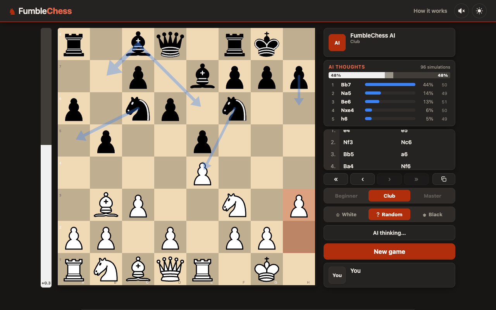
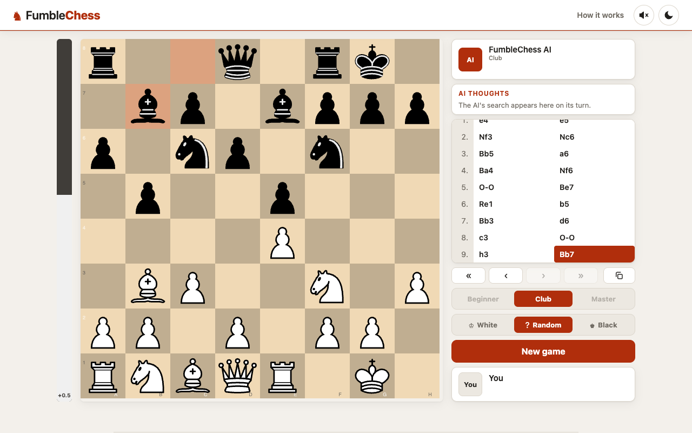
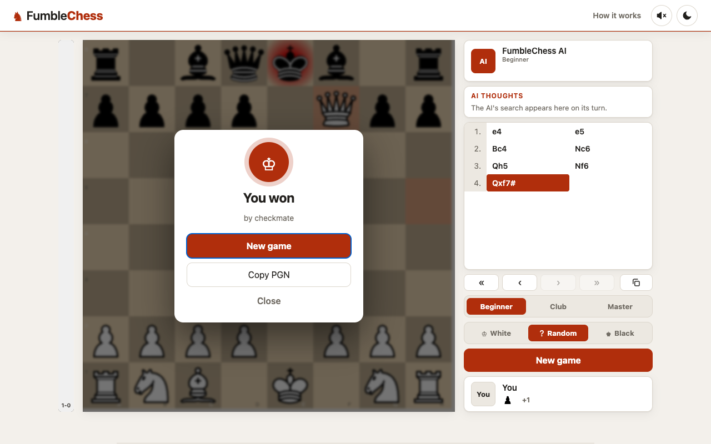
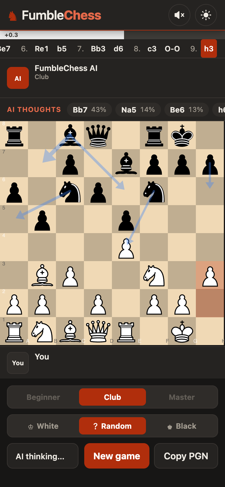

<h1 align="center">FumbleChess</h1>

<p align="center">
  <strong>A chess opponent that plays like a person, blunders included.</strong><br/>
  A transformer trained on real Lichess games, with a small neural tree search, running entirely in your browser.
</p>

<p align="center">
  
  
  
  
  <a href="https://fumblechess.lucabonaldo.dev"></a>
  
</p>

<p align="center">
  <a href="https://fumblechess.lucabonaldo.dev"><strong>Play it live</strong></a> ·
  <a href="docs/architecture.md">Architecture</a> ·
  <a href="docs/training.md">Training &amp; rating</a> ·
  <a href="https://github.com/LucaBonaldoIT/fumblechess/issues">Report an issue</a> ·
  <a href="CONTRIBUTING.md">Contributing</a> ·
  <a href="SECURITY.md">Security</a>
</p>

<p align="center"></p>

## Why

Strong engines play moves no human would. FumbleChess goes the other way: it is trained to predict **which move a
human of a given rating would play**, so it develops, attacks and hangs pieces like one. A small search on top lets
it look a few moves ahead without turning it into an engine.

## Features

- **Three levels**, each its own network trained on games between players of one Elo band: **Beginner**
  (800-1200), **Club** (1600-2400) and **Master** (2400+). The level is fixed while a game is on.
- **Neural tree search**: AlphaZero-style MCTS driven by the network's policy and value, with a deliberately small
  budget. The move is _sampled_ from the search, so it never plays the same game twice.
- **Watch it think**: the "AI thoughts" panel shows the candidate moves, their share of the search and expected
  score, with arrows on the board, live.
- **Stockfish evaluation bar** (WebAssembly), also while you browse the move history.
- Play White, Black or Random · clickable move history with keyboard navigation · captured pieces and material
  balance · game-over card · **Copy PGN** · light and dark themes · sound effects · responsive, mobile-first layout.
- **Educational**: the About section explains the network, the training and the search.
- **Private and offline-friendly**: the networks and Stockfish run in your browser; nothing is sent anywhere.

<p align="center">
  
  
  
</p>

## How it plays

1. The position becomes 64 tokens (one per square, 34 features each: pieces, side to move, castling, en passant,
   repetitions, move counters and the last 6 moves played).
2. A **transformer** (8 layers, about 7M parameters) outputs a **policy** (how natural each move looks) and a **value**
   (who is winning).
3. A **Monte-Carlo tree search** (24, 96 or 180 simulations by level) tests those instincts a few moves deep.
4. The final move is **sampled** from the search's visit counts: strong enough to avoid nonsense, loose enough to
   fumble.

Full details in [docs/architecture.md](docs/architecture.md) and in the app's About section.

## Strength

Rated against Stockfish on its UCI_Elo scale (20 games per pairing, 95% intervals): **Beginner 840 ± 196**,
**Club 1074 ± 138**, **Master 1312 ± 121** (the first Beginner model, trained on 80,000 positions without the move
history, was 698 ± 220). That scale is **not** the Lichess scale of the training data, so read it as rough and
relative. Method, caveats and the script: [docs/training.md](docs/training.md).

## Run it

```sh
npm install
npm run dev        # http://localhost:5173
npm run build      # static site in dist/
npm run preview
npm test           # unit tests
npm run typecheck
```

The app is live at **[fumblechess.lucabonaldo.dev](https://fumblechess.lucabonaldo.dev)**.

The trained models (about 14 MB each, fp16 weights) are not in the repository: put `level{1,2,3}.onnx` in
`public/models/` (or train them with `ml/train_levels.sh`), and Vite serves them in development and copies them into
`dist/models/` at build time. `./build.sh` stops if any of them is missing. The build is a static site:
host it anywhere that serves `.wasm` and `.onnx` files. The canonical URL, Open Graph tags, `sitemap.xml` and
`robots.txt` are generated from `SITE_URL` (default `https://fumblechess.lucabonaldo.dev`):
`SITE_URL=https://example.com npm run build`.

## Project layout

```
src/
  main.ts          app controller
  engine/          encoding · MCTS · network (ONNX) · Stockfish · levels · eval bar
  ui/              thoughts panel · dialogs · sound · theme · clipboard · About
scripts/           SEO build plugin, social image and icon generator
tests/             Vitest: encoder parity with Python, search, eval bar, repetitions
ml/                Python pipeline: fetch data · train · export · rate against Stockfish
public/models/     the three trained networks (ONNX), git-ignored
docs/              architecture and training write-ups, screenshots
```

## Retrain or rate the models

See [ml/README.md](ml/README.md): fetch data from the Lichess open database, train a model per level, export to
ONNX, and estimate Elo against Stockfish.

## Documentation

- [Architecture](docs/architecture.md)
- [Training and rating](docs/training.md)
- [Contributing](CONTRIBUTING.md) · [Code of conduct](CODE_OF_CONDUCT.md) · [Security](SECURITY.md) · [Changelog](CHANGELOG.md)

## License

[GPL-3.0-or-later](LICENSE), because the app bundles [Chessground](https://github.com/lichess-org/chessground) and
[Stockfish.js](https://github.com/nmrugg/stockfish.js), both GPL. Other dependencies, the training data (Lichess
open database, CC0) and the research this builds on are listed in [THIRD_PARTY_NOTICES.md](THIRD_PARTY_NOTICES.md).
Not affiliated with Lichess, Chess.com or the Stockfish team.

Made by [Luca Bonaldo](https://lucabonaldo.dev).
